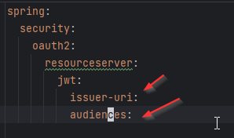
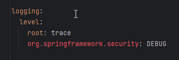
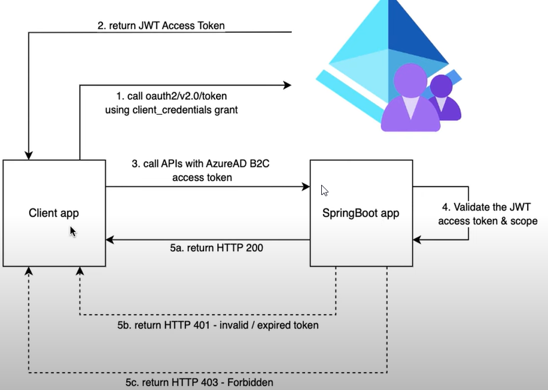

# PROTECT API SPRINGBOOT WITH OAUTH AZURE EXTERNAL ID 

## Technologies
* Gradle multi modules
* Oauth2.0 with Azure External Id
* Spring Security
* Spring Oauth2

## Resources
* how to create an azure free account: https://www.youtube.com/watch?v=szfjEwF-FKQ
* configure azure budget/cost alerts: https://www.youtube.com/watch?v=T5TnV1bgKuo
* how to secure SpringBoot Rest Apis using AzureAD B2C OAuth scopes: https://www.youtube.com/watch?v=hiBeW4-hrfE
* microsoft documentation to protectApi using Entra ID oauth2: https://learn.microsoft.com/en-us/azure/databricks/dev-tools/app-aad-token
* spring documentation to config yaml with issuer and audience: https://docs.spring.io/spring-security/reference/servlet/oauth2/resource-server/jwt.html
* multi module java project with Gradle: https://www.youtube.com/watch?v=pSKY3-K9_qc
* postman collection: postman/AZUREAD-OAUTH.postman_collection.json
* architecture image: doc/arquitectura.png

# Azure EntraID OAUTH2 configuration manual
* See the next document: [documenation.docx](doc/PROCEDIMIENTO%20CONFIGURACION%20AZURE%20ENTRAID%20OAUTH2.docx)

# application yaml's documentation

* issuer-uri: iss jwt property
* audiences: aud jwt property

* It allows you to log spring security

## Architecture

